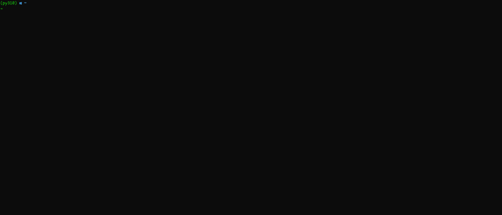

# How to update the Azure CLI

You can rely on package managers to update a local install of the Azure CLI on Windows, macOS and Linux environments (see the `Update` section in each platform-specific install instruction). The CLI also provides in-tool commands to upgrade manually or automatically.

## Manual Update
[!INCLUDE [az-upgrade](includes/az-upgrade.md)]

`az upgrade` is supported on Windows, macOS and some Linux distros as long as installation is supported. It only supports upgrading to the latest version. If you are running the Azure CLI through Azure Cloud Shell, you are most likely already using the most recent Azure CLI install. If not due to cases like ad-hoc release of a minor bug fix version, you need to wait for the next build of Azure Cloud Shell as `az upgrade` is not supported in Azure Cloud Shell.

When `azure-cli` is already the latest version, running `az upgrade` will check and update all installed [extensions](azure-cli-extensions-overview.md).

## Automatic Update

By default, auto-upgrade for Azure CLI is disabled. If you would like to keep up with the latest version, you can enable auto-upgrade through [configuration](../latest/docs-ref-autogen/config.yml).

```azurecli
az config set auto-upgrade.enable=yes
```

The Azure CLI will check new versions regularly and prompt you to upgrade after any command finishes running once the update is available.

The prompt message and output messages during upgrade may interrupt your command result if it is assigned to some variable or in an automated flow. To avoid interruption, you can use the following configuration to allow the update to happen automatically without confirmation and only show warnings and errors during the upgrade.

```azurecli
az config set auto-upgrade.prompt=no
```

By default, all installed extensions will also be updated. You can disable extension update through configuration.

```azurecli
az config set auto-upgrade.all=no
```

> [!NOTE]
> Please wait for `az upgrade` to complete before proceeding to the next set of commands, else the new versions of the CLI (+extensions) may have breaking changes.

If you decide not to use the automatic update feature any more for cases like keeping command scripts running stably, you can turn it off through configuration.
```azurecli
az config set auto-upgrade.enable=no
```
## Update Assistance

The Azure cli also provides a reference command, [az command-change](https://github.com/Azure/azure-cli-extensions/tree/main/src/command-change) and a website, [azure-cli-diff-site](https://azure-cli-diff-site.azurewebsites.net/), to help you examine changes between CLI versions. Use the version comparison list provided to prepare your scripts for a version update. See [Breaking change detection for the Azure CLI](https://github.com/Azure/azure-cli/blob/dev/doc/breaking_change_detection_guidelines.md) for more information.

### command-change
Here is example output for [az command-change](https://github.com/Azure/azure-cli-extensions/tree/main/src/command-change):


### azure-cli-diff-site
Here is example output from the [azure-cli-diff-site](https://azure-cli-diff-site.azurewebsites.net/):

